<div align="center">

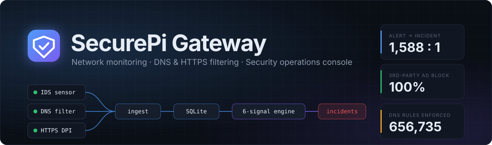

<br>

**A unified network monitoring, filtering and security platform for a small-enterprise network.**<br>
Built as a final-year engineering project, deployed on real hardware, and measured against real traffic rather than a simulation.

<br>

     

    

<br>

[**Overview**](#overview) · [**Console tour**](#console-tour) · [**Architecture**](#architecture) · [**How it works**](#how-it-works) · [**Evaluation**](#evaluation) · [**Roadmap**](#roadmap) · [**Getting started**](#getting-started) · [**Documentation**](#documentation)

</div>

---

## Overview

SecurePi Gateway sits between a network and its internet uplink and turns a single
low-cost machine into the three things a small office normally buys separately:

<table>
<tr>
<td width="33%" valign="top">

### Filter
**DNS filtering** for every device, with 656,735 rules from five curated
blocklists. DoT, known DoH and QUIC are blocked so devices can't route around it.
**Selective HTTPS inspection** removes first-party YouTube ads for devices that opt in.
It decrypts nothing else.

</td>
<td width="33%" valign="top">

### Detect
**Suricata IDS**, the DNS resolver and the inspection proxy all write into one event
store. A **correlation engine** runs fourteen signal checks over that data every 15 seconds,
merges repeat detections, and links related incidents into **campaigns** mapped to a MITRE
ATT&CK kill chain, so **15,884 raw events became 10 incidents** over a real
24-hour window.

</td>
<td width="33%" valign="top">

### Respond
A **security operations console** with a live dashboard, an incident workbench
(evidence chain, ATT&CK tags, playbooks, notes), threat hunting, per-device policy,
one-click **quarantine**, explainable risk scores, a weekly PDF report and a full
audit trail.

</td>
</tr>
</table>

> [!NOTE]
> **Built to be defended, not only demonstrated.** Every detection is a plain SQL query you
> can run by hand. Every incident links to the exact events that caused it. Every number
> in this README can be reproduced with [`gateway/evaluate.py`](gateway/evaluate.py).
> Limitations are written down next to the results, not left out.

### At a glance

| | Result | Source |
|---|---|---|
| **Alert-to-incident reduction** | **1,588 : 1** over a clean 24-hour window | [Evaluation §2](EVALUATION-RESULTS.md) |
| **Third-party ad blocking** | **100%** (10/10 fixed test domains) | [Evaluation §4](EVALUATION-RESULTS.md) |
| **Detection** | 4 attack types × 3 runs each, **all detected**. 6/6 signals verified live. One real bug found and fixed along the way | [Evaluation §1](EVALUATION-RESULTS.md) |
| **DNS rules enforced** | **656,735** across 5 curated lists | Live AdGuard Home |
| **Memory under attack load** | **40%** of 3.6 GiB used, over 2 GiB free | [Evaluation §5](EVALUATION-RESULTS.md) |
| **Throughput headroom** | Limited by the WAN (~30 Mbps). The inspection path itself ran at **39.9 Gbps** on virtual links | [Evaluation §6](EVALUATION-RESULTS.md) |
| **Automated tests** | **206** unit tests (`make test`), all on synthetic data | [`tests/`](tests) |

---

## Console tour

> [!IMPORTANT]
> These screenshots show the **real console code** with **synthetic demo data**. No real
> person's devices or browsing appear. The devices and traffic are generated by
> [`docs/demo/seed.py`](docs/demo). The open incidents were raised by the project's own
> correlation engine running on that data, not typed in by hand. You can regenerate every image
> yourself (see [Run the console locally](#2-run-the-console-locally-with-demo-data)).

<p align="center">
  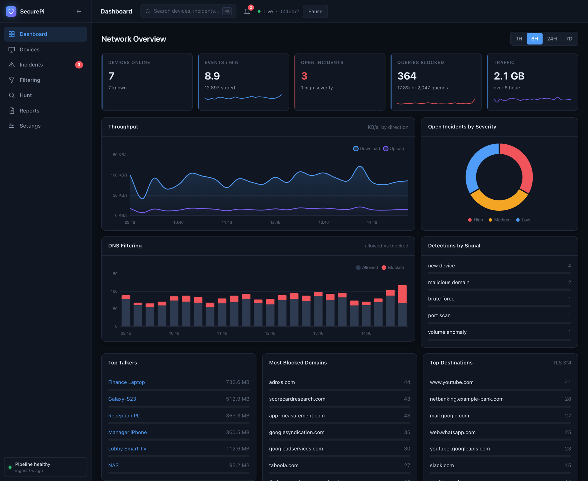
  <br><sub><b>Network overview</b>: KPI tiles with sparklines, throughput, DNS allowed vs blocked, severity breakdown, detections by signal, top talkers, and blocked and contacted domains.</sub>
</p>

<table>
<tr>
<td width="50%" valign="top">
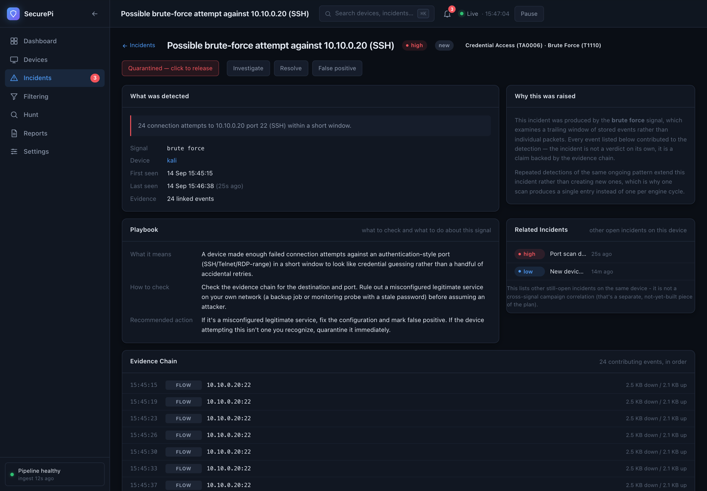
<p align="center"><sub><b>Incident workbench</b>: what was detected and why, the MITRE ATT&CK tag, a playbook, the evidence chain, related incidents and quarantine.</sub></p>
</td>
<td width="50%" valign="top">
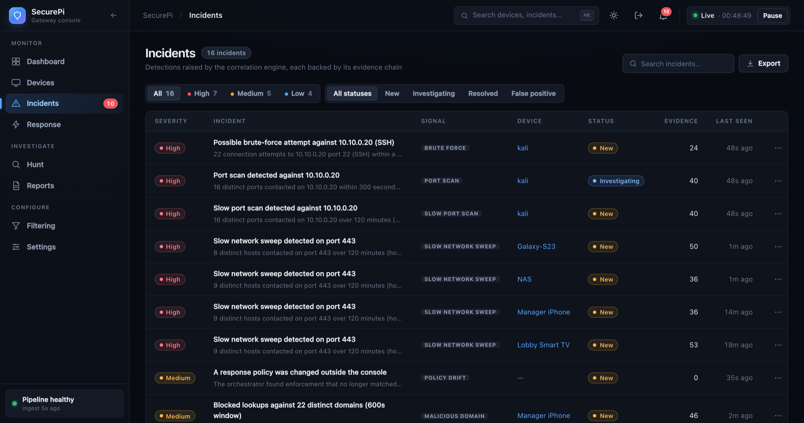
<p align="center"><sub><b>Incident queue</b>: severity and status filters, triage states (new, investigating, resolved, false positive), evidence counts and CSV export.</sub></p>
</td>
</tr>
<tr>
<td width="50%" valign="top">
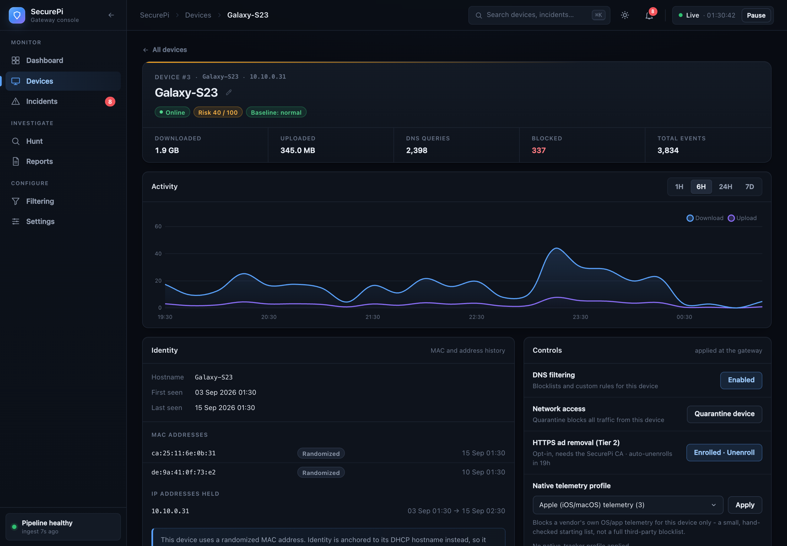
<p align="center"><sub><b>Device profile</b>: traffic history, identity kept across MAC randomization, fingerprint (type, vendor, OS and confidence), behavioural baseline and risk score.</sub></p>
</td>
<td width="50%" valign="top">
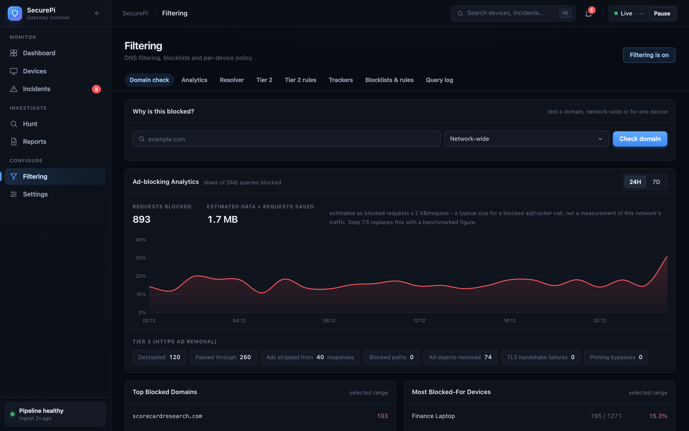
<p align="center"><sub><b>Filtering</b>: "why is this blocked?" tester, ad-blocking analytics, Tier 2 HTTPS ad-removal counters, and top blocked domains and devices.</sub></p>
</td>
</tr>
<tr>
<td width="50%" valign="top">
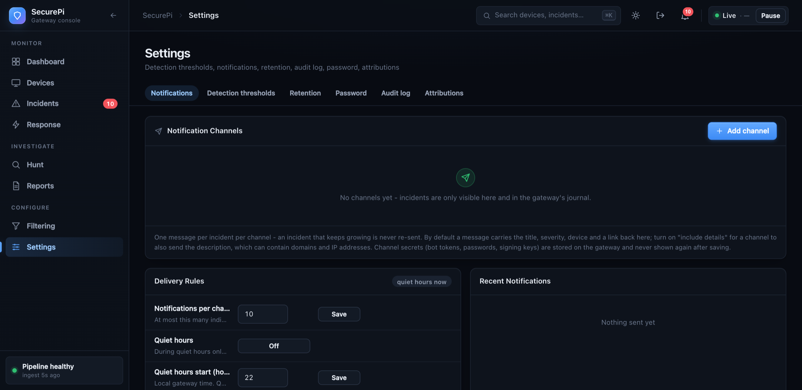
<p align="center"><sub><b>Settings</b>: detection thresholds and windows you can change from the console. Each change is validated, audited and picked up on the engine's next cycle.</sub></p>
</td>
<td width="50%" valign="top" align="center">
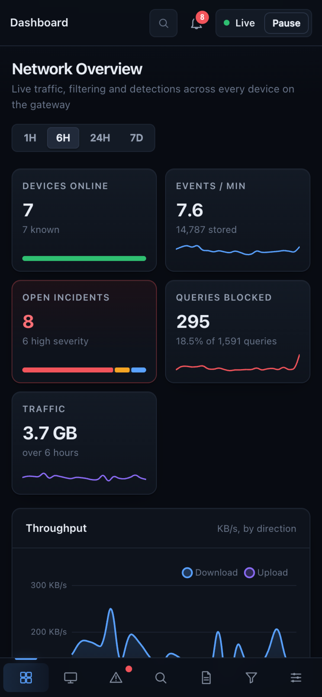
<p align="center"><sub><b>Responsive</b>: every page is usable at phone width.</sub></p>
</td>
</tr>
</table>

<details>
<summary><b>Other console features not pictured</b></summary>

<br>

- **Hunt / explorer**: search flows, DNS and TLS by device, IP, domain, port and time range. Pivot on any value, see top talkers and protocol breakdowns, and save searches.
- **Weekly report**: incidents by ATT&CK tactic, riskiest devices, ad-blocking summary (block rate, tracker companies, estimated savings) and platform health, for any past week, printable to PDF.
- **Command palette** (<kbd>⌘</kbd>/<kbd>Ctrl</kbd> + <kbd>K</kbd>), live notifications, a pause/resume live mode, and a pipeline-health panel showing ingest and each signal's last run.
- **Per-device policy**: DNS filtering on or off, native-tracker blocklist profiles, time-limited allow and block rules ("unbreak this site"), and Tier 2 enrollment with auto-expiry.
- **Blocklist health**: time since each list last synced, a stale warning after 48 hours, and each list's share of observed blocks.
- **Audit log**: every console action that changes something (status changes, rules, settings, quarantine, enrollment) is recorded with who did it and when.

</details>

---

## Architecture

<p align="center">    <br><sub>Colour key used in every diagram below, matching the console's palette</sub></p>

### Deployment topology

The existing home router is only the upstream link and needs no configuration changes. The gateway
gets its internet over Wi-Fi and serves the project network from an access point on the
same radio. A separate wired link is used only for management.

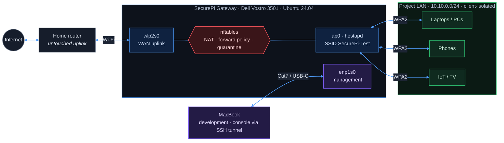

### Data pipeline

Three sensors write into one shared event table. The correlation engine and the console both
read from it directly, so what the console shows is exactly what detection saw. The console
also writes back: quarantine and enrollment go to nftables sets, and filtering rules and
per-device policy go to AdGuard Home's API.

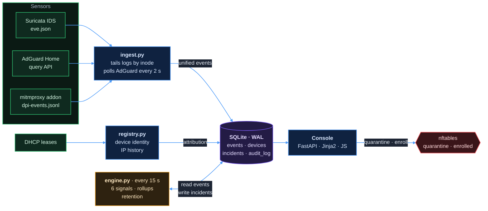

### Technology

| Layer | Choice | Why |
|---|---|---|
| Host | Ubuntu Server 24.04 LTS on an x86-64 laptop (i3-1005G1, **3.6 GiB RAM**) | x86-64 packages, an SSD and a built-in battery. The small RAM budget ruled out Docker from day one |
| Network | `hostapd`, `nftables`, AdGuard Home DHCP | Router, access point, NAT and firewall on one box |
| Sensing | **Suricata 7** (af-packet), **AdGuard Home**, **mitmproxy 12** addon | IDS flows/alerts, DNS decisions, selective TLS inspection |
| Storage | **SQLite** in WAL mode, one unified `events` table | One `events` table, so no UNIONs across tables in detection queries. Readers never block the writer |
| Detection | Plain Python and windowed SQL, no framework | Every detection is a query anyone can run by hand to check it |
| Console | **FastAPI**, Jinja2, vanilla JS, **Chart.js 4**, one hand-written stylesheet | No build step and no SPA framework. HTTP Basic Auth runs as middleware and blocks every request if the password file is missing |
| Testing | `unittest` (pytest-compatible), in-memory SQLite fixtures | Runs on the Mac in well under a second, without the gateway |

---

## How it works

### Correlation engine

Each signal is a **windowed SQL query** over recent events, re-run in full every 15 seconds.
There are no in-memory counters: state is bounded by the query's time range, and every detection can
be reproduced by hand. When a signal fires, `raise_incident()` either **extends an open incident**
for the same device and signal within the dedup window, or opens a new one. That merge step
produces the reduction ratio.

| Signal | Looks for | Default trigger | Severity | ATT&CK |
|---|---|---|:---:|---|
| `port_scan` | One device touching many distinct ports on **one** host (vertical scan) | ≥ 8 ports in 300 s |  | Discovery · [T1046](https://attack.mitre.org/techniques/T1046/) |
| `network_sweep` | One device touching one port across many distinct **hosts** (horizontal scan) | ≥ 8 hosts in 300 s |  | Discovery · [T1018](https://attack.mitre.org/techniques/T1018/) |
| `slow_port_scan` / `slow_network_sweep` | The same two patterns above, paced too slowly for their fast window to ever catch (nmap `-T0`/`-T1`-style timing) | ≥ 8 over 7200 s |  | Same techniques as above |
| `brute_force` | Many short connections to an auth port (SSH, FTP, Telnet, RDP, SMTP) | ≥ 6 attempts in 120 s |  | Credential Access · [T1110](https://attack.mitre.org/techniques/T1110/) |
| `malicious_domain` | Blocked lookups across many **distinct** domains (not raw volume, which is mostly SDK retries) | ≥ 15 distinct in 600 s |  | *not tagged on purpose*¹ |
| `dns_bypass` | A device routing DNS around AdGuard: rejected DoT/DoH/QUIC, Firefox/Apple canary-domain queries, or a TLS SNI matching a known DoH provider | ≥ 3 combined indicators in 300 s |  | Defense Evasion · [TA0005](https://attack.mitre.org/tactics/TA0005/) (tactic only)¹ |
| `ids_*` (8 types) | Suricata/ET Open alerts, grouped by device + category. 7 curated types (trojan, C2, C2 domain, exploit kit, shellcode, privilege gain, credential theft) each get a plain name and ATT&CK tag; everything else falls to `ids_other`, severity from Suricata's own priority | ≥ 3 of the same category in 300 s | varies by category | Varies - see [`app/signature_taxonomy.py`](app/signature_taxonomy.py) |
| `threat_intel` | A device contacted an IP or domain confirmed malicious by abuse.ch's Feodo Tracker, URLhaus or ThreatFox (daily-refreshed, 5,600+ real indicators) | ≥ 1 match in 3600 s |  | Command and Control · [TA0011](https://attack.mitre.org/tactics/TA0011/) (tactic only) |
| `dns_tunneling` | Many distinct high-entropy subdomains, or an unusual TXT-query ratio, under one domain - data smuggled out through DNS | ≥ 20 distinct subdomains + entropy/TXT-ratio in 600 s |  | Command and Control · [T1071.004](https://attack.mitre.org/techniques/T1071/004/) |
| `dga` | A burst of *genuine* NXDOMAIN lookups (not just blocked) with high-entropy labels - malware hunting for its C2 domain | ≥ 10 NXDOMAIN + entropy in 600 s |  | Command and Control · [T1568.002](https://attack.mitre.org/techniques/T1568/002/) |
| `beacon` | RITA-style regularity score (coefficient of variation of timing + connection size) to one destination - a fixed-timer C2 check-in, not human or app traffic | score ≥ 0.8 over ≥ 8 connections in 3600 s |  | Command and Control · [T1071](https://attack.mitre.org/techniques/T1071/) |
| `volume_anomaly` | Traffic far above **this device's own** baseline for this hour of day | z > 3.0 after 7 days of history |  | Exfiltration · [TA0010](https://attack.mitre.org/tactics/TA0010/) (tactic only) |
| `new_device` | A device the registry has never seen | 30 s grace, 1 h lookback |  | *informational* |
| `adblock_ineffective` | YouTube being decrypted but nothing stripped: a format change or server-side ad insertion | ≥ 5 decrypts, 0 stripped in 1 h |  | *health check of this platform* |

<sub>¹ A blocklist hit on an ad or tracker domain, or an encrypted-DNS attempt, is not evidence of contact with attacker infrastructure or of intent to evade this network specifically (modern devices increasingly enable encrypted DNS by default for ordinary privacy reasons) - tagging either with a specific technique would overstate the finding. The reasoning is in <a href="app/playbooks.py"><code>app/playbooks.py</code></a>.</sub>

<details>
<summary><b>Sequence: from a live SSH brute-force to a quarantined device</b></summary>

<br>

```mermaid
%%{init: {'theme':'base','themeVariables':{'actorBkg':'#161d2b','actorBorder':'#4f9cf9','actorTextColor':'#e6ecf5','actorLineColor':'#3a4760','signalColor':'#4f9cf9','signalTextColor':'#e6ecf5','sequenceNumberColor':'#0a0e15','labelBoxBkgColor':'#f5a524','labelBoxBorderColor':'#f5a524','labelTextColor':'#0a0e15','loopTextColor':'#ffd58a','noteBkgColor':'#2e2210','noteTextColor':'#ffe9c2','noteBorderColor':'#f5a524','primaryColor':'#161d2b','primaryTextColor':'#e6ecf5','lineColor':'#4f9cf9'},'sequence':{'mirrorActors':false,'messageMargin':34,'boxMargin':8}}}%%
sequenceDiagram
    autonumber
    participant A as Unknown device
    participant S as Suricata + ingest
    participant D as SQLite
    participant E as Engine
    participant O as Operator
    participant N as nftables

    rect rgb(11, 32, 24)
    A->>S: 24 short TCP connections to NAS :22
    S->>D: flow events, attributed by IP history
    end
    rect rgb(12, 26, 48)
    loop every 15 s
        E->>D: brute_force query, trailing 120 s
        alt no open incident for device + signal
            E->>D: new incident + evidence links
        else open incident in dedup window
            E->>D: extend last_seen, recount evidence
        end
    end
    end
    rect rgb(46, 17, 21)
    O->>D: review evidence chain + T1110 playbook
    O->>N: Quarantine (add IP to set)
    N-->>A: forward chain drops all traffic
    O->>D: status investigating, note, audit_log
    end
```

</details>

<details>
<summary><b>Incident lifecycle</b></summary>

<br>

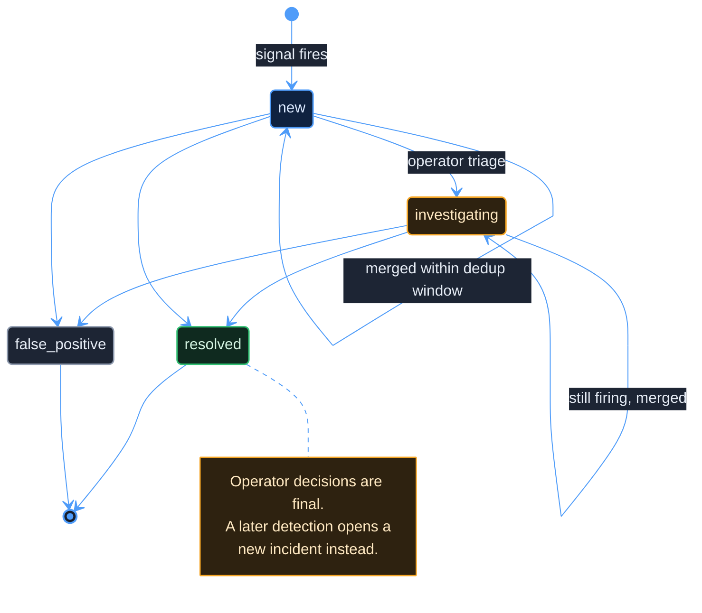

</details>

### Campaign correlation and the MITRE ATT&CK kill chain

A single signal firing is one data point. Several signals firing for the *same device*, each mapping to a *different* MITRE ATT&CK tactic, is a story: a device that gets scanned, then brute-forced, then starts beaconing out isn't three unrelated events — it's one attack moving through recognizable stages. `campaign_signal` links a device's open incidents into a campaign once they span **two or more distinct tactics** (two scan variants are one stage, not a pattern), and records the kill chain itself as the ordered sequence of tactics — `Discovery → Credential Access → Command and Control` for exactly that example. An open campaign adds one more named, decaying term to the device's risk score, on top of what its linked incidents already contribute — real evidence the *correlation* itself matters, not just the individual pieces.

An operator's **false-positive verdict** on an incident can also become a **suppression rule** — scoped to one signal for one device, or network-wide, with an optional expiry — so a recognized non-issue doesn't need re-dismissing every time it recurs. `raise_incident()`, the single function every signal funnels through, checks active suppressions first and writes nothing at all while one applies.

### Device identity under MAC randomization

Modern phones randomize their MAC per network and rotate it, so neither a MAC nor an IP is a stable identity.
The registry anchors identity on the DHCP hostname and records every MAC and IP beneath a device as
**time intervals**. An event from three hours ago is attributed to whoever held that address three hours ago,
not to whoever holds it now.

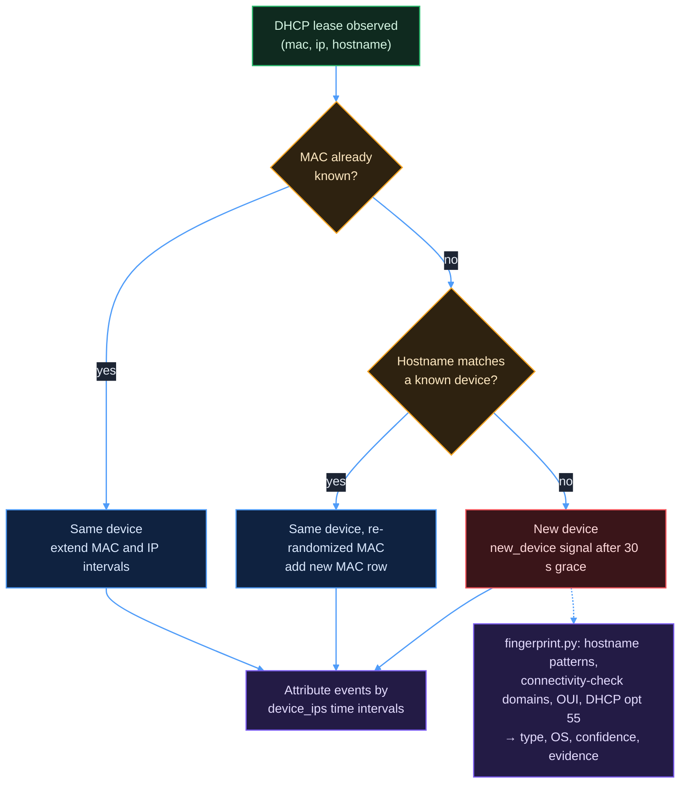

### Two-tier ad blocking

DNS filtering cannot remove YouTube ads, because the ad video comes from the same domain as the
real video. Tier 2 handles that case, and it is limited in two ways: **only enrolled devices** are
redirected, and **only allowlisted hostnames** are decrypted. The proxy sees the requested hostname
(SNI) *before* any decryption. Banking, email and messaging connections pass through as encrypted bytes,
and no certificate is ever presented for them.

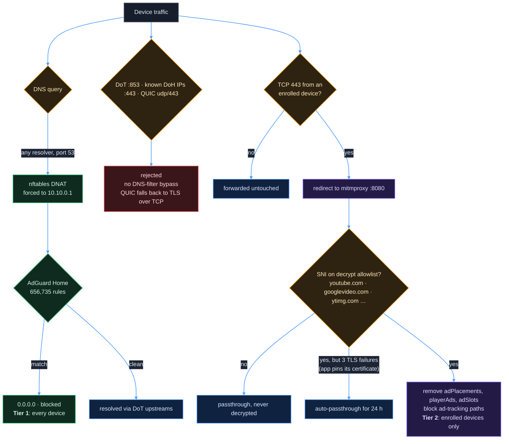

<details>
<summary><b>Tier 2 safeguards</b></summary>

<br>

| Safeguard | What it does |
|---|---|
| **Off after every reboot** | Enrollment has to be switched on deliberately each time and never persists silently. `securepi status` reports it explicitly |
| **Auto-unenroll** | Each enrollment is an nftables set element with a **24 h timeout**, so the kernel expires it without needing a scheduler |
| **Privacy-scope canary** | Every 15 minutes, `dpi/privacy_canary.py` checks the deployed addon's decision for a must-pass host and a must-decrypt host. If either is wrong, **every device is unenrolled** and a high-severity incident is raised |
| **Pinning-aware passthrough** | Apps that pin their certificate stop being decrypted instead of staying broken |
| **Effectiveness watchdog** | The `adblock_ineffective` signal reports when ad removal stops working (for example, server-side ad insertion) |
| **Versioned rules** | The decrypt allowlist, ad fields and blocked paths are in [`dpi/adfilter-rules.json`](dpi/adfilter-rules.json), can be edited from the console, and are covered by tests |
| **CA never leaves the gateway** | Generated on the box, root-only, excluded from git by `.gitignore` |

</details>

### Explainable risk scoring

A device's risk score is a sum of named contributions from its **open** incidents, each decaying with a
24-hour half-life. Resolved incidents and false positives contribute nothing, and the console shows
each term that makes up the score.

$$
\text{risk}(d) = \min\left(100, \sum_{i \in \text{open}(d)} w_{\text{sev}(i)} \cdot 0.5^{\Delta t_i / 24\text{h}}\right), \qquad w_{\text{high}} = 40, \quad w_{\text{medium}} = 20, \quad w_{\text{low}} = 8
$$

### Data model and retention

<details>
<summary><b>Entity-relationship diagram</b> (<code>app/schema.sql</code>)</summary>

<br>

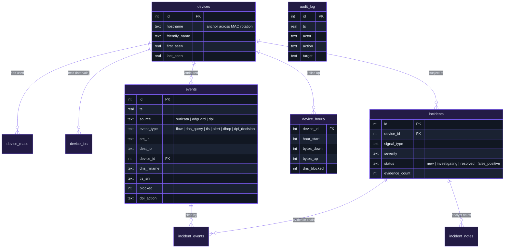

</details>

| Data | Kept for | Note |
|---|---|---|
| Flow / TLS / QUIC events | 14 days | Highest volume |
| DNS, alerts, all other events | 30 days | |
| Hourly device rollups | 180 days | Feeds behavioural baselines |
| Incidents | 365 days | An event cited as evidence is **never** pruned while its incident exists |
| Audit log | Forever | An audit trail that deletes its own history would defeat its purpose |

---

## Evaluation

Measured on 13 September 2026 against the live gateway with a scripted harness. Attacks ran from isolated network
namespaces (`ns_attacker` → `ns_victim`) using `nmap` and `hydra`, and **never touched the real
devices on the network**. Full method and raw figures: [`EVALUATION-RESULTS.md`](EVALUATION-RESULTS.md).

<table>
<tr>
<td width="55%" valign="top">

**Detection rate and time to detect** (3 runs per attack)

| Signal | Detected | Mean latency |
|---|:---:|---:|
| Port scan | 3 / 3 | 25.4 s |
| Brute force | 3 / 3 | 34.0 s |
| Malicious domain | 3 / 3 | 11.3 s* |
| New device | 3 / 3 | 45.1 s |

<sub>The first run of each attack is the slowest because it waits for a fresh engine cycle. Runs 2 and 3 fall inside the dedup window and extend the same incident, which is the reduction ratio working as designed. New-device latency is structural: 30 s grace plus one 15 s cycle.</sub>

</td>
<td width="45%" valign="top">

**Resource use under attack load**

| Service | Memory |
|---|---:|
| Suricata | 683 MB |
| AdGuard Home | 235 MB |
| Console (`securepi-web`) | 121 MB |
| Ingest | 15 MB |
| Correlation engine | 5 MB |
| **System total** | **1,457 / 3,683 MB** |

<sub>Load average 0.17. The day-1 memory budget from the build plan held.</sub>

</td>
</tr>
</table>

> [!WARNING]
> **Limitations found and reported honestly**
> - **A real bug found during evaluation:** `new_device_signal` used a persisted watermark that meant new devices were almost never detected. It was fixed, verified live, and is now covered by regression tests.
> - **\*Malicious-domain latency** was originally limited by AdGuard only flushing its on-disk query log every 1,000 queries. Ingest now polls AdGuard's API in real time instead (step 1.4).
> - **One false positive** on a real phone: ordinary ad-SDK background traffic crossed a *raw-count* threshold. The signal now counts **distinct** domains (step 1.6).
> - **Quarantine is keyed on IP**, so a DHCP renewal can move a quarantined device to a new address. Matching on MAC in PREROUTING is future work, noted in [`app/quarantine.py`](app/quarantine.py).

---

## Roadmap

The full plan (market comparison, gap analysis, and a log of how each step was implemented, deployed and verified)
is in [`ENHANCEMENT-PLAN.md`](ENHANCEMENT-PLAN.md).

| Stage | Focus | Status |
|:---:|---|---|
| **0** | Housekeeping |  |
| **1** | **Foundation and correctness**: test suite, retention, real-time ingest, audit coverage, detection-accuracy fixes, AP client isolation |  |
| **2** | **Detection breadth**: network sweep, DNS bypass hardening, IDS alerts, threat intel, DNS tunnelling/DGA, C2 beaconing, suppression rules, campaigns |  |
| **3** | Hardening and reliability: session auth, TLS, health supervision |  |
| **4** | Response and orchestration: policy profiles, timed quarantine, notifications |  |
| **5** | **Ad blocking and privacy filtering**: telemetry, unbreak workflow, analytics, list health, Tier 2 lifecycle, privacy canary, pinning bypass, watchdog |  |
| **6** | **Intelligence and console**: baselines, fingerprinting, settings, incident workbench, hunt, weekly report, responsive layout |  |
| **7** | Evaluation 2.0: expanded benchmark battery, 7-day continuous run |  |
| **8** | Documentation and demo |  |

<sub>Stages 5 and 6 were built before Stages 1–2 on purpose, where the order didn't affect correctness. Each of those decisions and its reasoning is recorded in the plan.</sub>

---

## Getting started

### Repository layout

```text
securepi-gateway/
├── app/                      Ingest, identity, correlation engine and console
│   ├── ingest.py             Suricata / AdGuard / DPI → unified events table
│   ├── registry.py           Device identity across MAC randomization
│   ├── correlation.py        The six detection signals + incident dedup
│   ├── engine.py             15-second loop: signals, rollups, retention
│   ├── risk.py · playbooks.py · fingerprint.py · quarantine.py · retention.py
│   ├── webapp.py             FastAPI console (pages + JSON API)
│   ├── schema.sql            The whole data model, with the reasoning in comments
│   ├── templates/  static/   Jinja2 pages, vanilla JS, one stylesheet
├── dpi/                      Selective HTTPS inspection (mitmproxy addon, rules, canary)
├── gateway/                  nftables, hostapd, `securepi` CLI, evaluation harness
├── tests/                    206 unit tests on synthetic fixtures (`make test`)
└── docs/
    ├── assets/               Banner, social preview, screenshots
    └── demo/                 Synthetic-data console used for the screenshots
```

### 1. Run the test suite

The code that can run anywhere (parsing, detection, retention, identity, DPI rule logic) is tested on the
development Mac against in-memory SQLite and synthetic Suricata and AdGuard records. It never touches the live gateway.

```bash
make test        # python3 -m unittest discover -s tests -p 'test_*.py' -v
```

### 2. Run the console locally with demo data

```bash
cd docs/demo
python3 seed.py && python3 serve.py
# open http://127.0.0.1:8765  (user: securepi, password: demo)
```

See [`docs/demo/README.md`](docs/demo/README.md) for regenerating the screenshots.

### 3. Operate the live gateway

<details>
<summary><b>Health check, HTTPS inspection, console access</b></summary>

<br>

```bash
./session-start.sh                                         # tunnel + full gateway status + git check
ssh maheshwari@192.168.2.5 'sudo securepi status'          # services, network, post-reboot to-dos
ssh maheshwari@192.168.2.5 'sudo securepi enroll all'      # Tier 2 HTTPS ad removal ON
ssh maheshwari@192.168.2.5 'sudo securepi unenroll all'    # and OFF
```

**Browsing the console from the Mac.** The console is reachable only from the project LAN by default.
To view it without joining `SecurePi-Test`, use the management link (Internet Sharing over the
Cat7/USB-C adapter must be on):

```bash
./mac-tunnel.sh start      # then open http://localhost:8000
./mac-tunnel.sh stop
```

**Logging in.** HTTP Basic Auth, username `securepi`. The password is stored only on the gateway, at
`/root/.securepi-console-password` (root-only, never in this repository). To set a new one:

```bash
ssh maheshwari@192.168.2.5 'echo "NEW_PASSWORD" | sudo tee /root/.securepi-console-password > /dev/null && sudo chmod 600 /root/.securepi-console-password'
```

Full host setup: [`STEP-1-INSTALL-UBUNTU.md`](STEP-1-INSTALL-UBUNTU.md) → [`GATEWAY-SETUP-RUNBOOK.md`](GATEWAY-SETUP-RUNBOOK.md).
Power-on and reboot notes: [`NEXT-SESSION.md`](NEXT-SESSION.md) and [`gateway/REBOOT-SAFETY.md`](gateway/REBOOT-SAFETY.md).

</details>

---

## Security and privacy

- **No secrets in git.** Keys, certificates, passwords, tokens, packet captures and query logs are all excluded by [`.gitignore`](.gitignore). The committed `hostapd.conf` has its passphrase redacted.
- **Minimal decryption.** HTTPS inspection is opt-in per device, expires after 24 hours, covers only a short hostname allowlist, and is checked by a canary every 15 minutes that unenrolls every device if the scope is wrong.
- **Fails closed.** The console rejects every request if its password file is missing, and the firewall's forward policy is `drop`.
- **Accountable.** Every console action that changes something is written to an audit log that retention never deletes.
- **Tested without real people's data.** Tests and demo screenshots use synthetic data only. Evaluation attacks ran in isolated namespaces.

---

## Documentation

| Document | Contents |
|---|---|
| [`ENHANCEMENT-PLAN.md`](ENHANCEMENT-PLAN.md) | **Active plan.** Market comparison, gap analysis, the stage-by-stage roadmap, and a log of how each step was implemented and verified |
| [`EVALUATION-RESULTS.md`](EVALUATION-RESULTS.md) | Detection rate, reduction ratio, false positives, ad-block ratio, resources, throughput |
| [`EVALUATION-RESULTS-2.md`](EVALUATION-RESULTS-2.md) | Results from Stage 1 onward — starts with the Stage 0 baseline snapshot |
| [`REPORT-adblocking.md`](REPORT-adblocking.md) | Report material for the two-tier ad-blocking subsystem |
| [`FIRST-PARTY-ADS-ANALYSIS.md`](FIRST-PARTY-ADS-ANALYSIS.md) | What network-level filtering can and cannot block |
| [`SECUREPI-15-DAY-PLAN.md`](SECUREPI-15-DAY-PLAN.md) | Original build plan, hardware constraints, confirmed topology, scope decisions |
| [`GATEWAY-SETUP-RUNBOOK.md`](GATEWAY-SETUP-RUNBOOK.md) · [`STEP-1-INSTALL-UBUNTU.md`](STEP-1-INSTALL-UBUNTU.md) | Host and network setup |
| [`NEXT-SESSION.md`](NEXT-SESSION.md) | Handoff notes: bringing the gateway back up, current status, what comes next |
| [`docs/feasibility-study.md`](docs/feasibility-study.md) | Original pre-implementation study: the full 38-week scope, architecture reasoning and technology selection behind every "why" in this README |
| [`docs/day1-status.md`](docs/day1-status.md) | Point-in-time status snapshot from the end of Day 1 of the original build |

---

<div align="center">

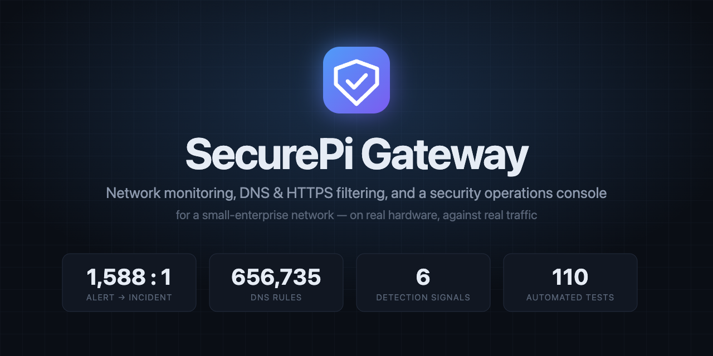

<sub><b>SecurePi Gateway</b> · Final-year engineering project · Built by <a href="https://github.com/MaheshwariKushagra">Kushagra Maheshwari</a></sub>

<sub><a href="#overview">Back to top ↑</a></sub>

</div>
