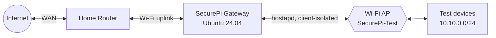
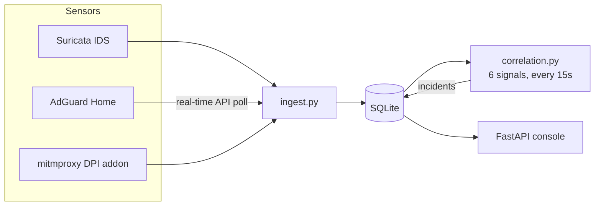

# SecurePi Gateway

**A unified network monitoring, filtering and security platform for a small-enterprise network.**
Final-year engineering project.


The gateway sits between the network and its uplink: DNS-based content filtering
for every device, selective HTTPS inspection for enrolled devices, and a full
security operations centre built on real network telemetry — routing, filtering,
sensing, detection, and a live console, evaluated against real traffic on real
hardware, not a simulation.

---

## Contents

- [Measured results](#measured-results)
- [What's working](#whats-working)
- [Project roadmap](#project-roadmap)
- [Architecture](#architecture)
- [Documents](#documents)
- [A note on credentials](#a-note-on-credentials)
- [Logging into the console](#logging-into-the-console)
- [Browsing the console from the Mac](#browsing-the-console-from-the-mac)

---

## Measured results

Real numbers, from `EVALUATION-RESULTS.md`, reproducible with `gateway/evaluate.py`
against the live gateway — never against the two real devices on the network.

| Metric | Result |
|---|---|
| Alert-to-incident reduction ratio | **1,588 : 1** over a clean 24h window |
| Third-party ad-block rate | **100%** (10/10 fixed test domains) |
| Detection signals verified | 6/6, live traffic, one real bug found and fixed along the way |
| DNS blocklist rules enforced | **656,735** rules across 5 curated lists |
| Memory under load | 40% used, 2 GiB+ free headroom |
| Throughput impact | WAN-bound (~30 Mbps); gateway itself has tens of Gbps of headroom |

## What's working

<table>
<tr><td valign="top">

**Network core**
- Routed gateway — DHCP, DNS, NAT
- Wi-Fi access point, client isolation
- DNS filtering, bypass-resistant
- Selective HTTPS inspection (first-party ad removal)

**Sensing & detection**
- Suricata IDS + full event pipeline
- Device registry, identity across MAC randomization
- Device type fingerprinting
- 6-signal correlation engine, console-tunable
- Real automated test suite (110+ tests)

</td><td valign="top">

**Console**
- Live dashboard, devices, incidents
- Incident workbench — ATT&CK tags, playbooks, notes
- Hunt / explorer — search, pivot, saved searches
- Filtering management, per-device policy
- Weekly report, print-to-PDF
- Settings — tunable thresholds, audit log
- Responsive down to phone width

**Operations**
- Quarantine action + undo
- Explainable, decaying risk scoring
- Full audit trail on every write action
- Data retention with evidence-chain safety

</td></tr>
</table>

## Project roadmap

Full detail, reasoning, and live-verification notes for every step live in
[`ENHANCEMENT-PLAN.md`](ENHANCEMENT-PLAN.md) — this is the compact view.

| Stage | Focus | Status |
|---|---|---|
| 0 | Housekeeping | Not started |
| **1** | **Foundation & correctness** — test suite, retention, real-time ingest, audit, detection fixes | **Complete** |
| 2 | Detection breadth — beaconing, DNS tunnelling, campaigns, MITRE ATT&CK | Not started |
| 3 | Hardening & reliability — session auth, TLS, health supervision | Not started |
| 4 | Response & orchestration — policy profiles, timed quarantine, notifications | Not started |
| **5** | **Ad blocking & privacy filtering** | **Complete** |
| **6** | **Intelligence & console** — baselines, fingerprinting, settings, incident workbench, hunt, reports, responsive layout | **Complete** |
| 7 | Evaluation 2.0 — expanded benchmark battery | Not started |
| 8 | Documentation & demo | Not started |

Stages were deliberately built out of plan order (5 and 6, then 1) where doing
so didn't compromise correctness — each such decision, and its reasoning, is
recorded in `ENHANCEMENT-PLAN.md` rather than left implicit.

## Architecture

The existing home router is treated purely as an upstream uplink; no configuration
change is required on it. The gateway takes its own internet over Wi-Fi and serves
the project network from an access point on the same radio.



Telemetry flows from three sensors into one shared event store, which the
correlation engine and console both read from directly:



## Documents

| File | Contents |
|---|---|
| [`ENHANCEMENT-PLAN.md`](ENHANCEMENT-PLAN.md) | **Active plan.** Market comparison, gap analysis, the ordered stage-by-stage roadmap, and a live log of every step's implementation, deployment and verification |
| [`EVALUATION-RESULTS.md`](EVALUATION-RESULTS.md) | Day 14 evaluation: detection rate, reduction ratio, false positives, resource/throughput |
| [`SECUREPI-15-DAY-PLAN.md`](SECUREPI-15-DAY-PLAN.md) | Original build plan, confirmed topology, scope decisions |
| [`GATEWAY-SETUP-RUNBOOK.md`](GATEWAY-SETUP-RUNBOOK.md) | Host and network setup |
| [`STEP-1-INSTALL-UBUNTU.md`](STEP-1-INSTALL-UBUNTU.md) | Operating system installation |
| [`REPORT-adblocking.md`](REPORT-adblocking.md) | Report material for the ad-blocking subsystem |
| [`FIRST-PARTY-ADS-ANALYSIS.md`](FIRST-PARTY-ADS-ANALYSIS.md) | Analysis of what network-level filtering can and cannot block |
| `app/` | Ingest pipeline, correlation engine, and the console (FastAPI + Jinja2 + vanilla JS) |
| `dpi/` | Selective HTTPS inspection addon and deployment script |
| `tests/` | The permanent automated test suite — `make test` |
| `gateway/evaluate.py` | Scripted evaluation battery — reproduces every number in `EVALUATION-RESULTS.md` |

## A note on credentials

No keys, certificates or passwords belong in this repository. The certificate authority
used for HTTPS inspection is generated on the gateway and never leaves it. See
`.gitignore`.

## Logging into the console

The console requires HTTP Basic Auth (username `securepi`). The password lives
only on the gateway, at `/root/.securepi-console-password` — root-only, never
in this repository. Ask whoever last set it, or generate a new one:

```
ssh maheshwari@192.168.2.5 'echo "NEW_PASSWORD" | sudo tee /root/.securepi-console-password > /dev/null && sudo chmod 600 /root/.securepi-console-password'
```

## Browsing the console from the Mac

The console is only reachable from the project LAN by default. To view it
from the Mac without joining `SecurePi-Test`:

```
./mac-tunnel.sh start      # then open http://localhost:8000
./mac-tunnel.sh stop
```

Requires the management link (Internet Sharing over the Cat7/USB-C adapter)
to be up.
